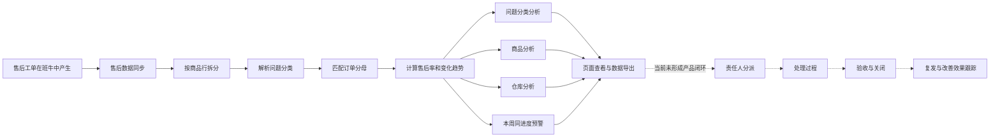

# 售后 CRM 现有业务梳理

更新日期：2026-08-18

## 1. 文档目的

本文档用于记录当前售后 CRM 已经承载的业务、已采集但尚未形成产品能力的信息，以及当前缺失的售后处理环节。

本文档只根据当前代码、项目文档和本地历史 Dashboard 快照整理，未连接生产服务器，未核对实际组织分工和线下处理流程。无法从现有资料确定的内容统一标记为“待确认”。

## 2. 当前产品定位

当前产品的实际定位是“售后经营异常分析与预警 Dashboard”。

它通过班牛售后数据与订单数据，识别商品、问题类型和仓库中出现的售后异常，为管理人员提供经营分析与早期预警。

当前产品主要回答以下问题：

- 最近哪些售后问题正在增加。
- 哪些商品的售后率较高或正在上升。
- 哪些仓库的库房问题较为突出。
- 本周同进度的表现是否坏于上周。
- 哪些数据需要进一步导出和排查。

当前产品尚不能回答以下问题：

- 异常由谁负责。
- 负责人采取了什么处理动作。
- 问题是否在规定时间内完成。
- 处理结果是否通过验收。
- 问题是否反复发生。
- 本次处理实际降低了多少售后损失。

## 3. 当前业务全景



## 4. 当前已有业务模块

| 业务模块 | 当前能力 | 状态 |
| --- | --- | --- |
| 售后数据采集 | 从班牛同步售后任务及子商品行 | 已有 |
| 售后数据标准化 | 将班牛自定义字段转换为订单、商品、问题和仓库字段 | 已有 |
| 问题分类 | 解析一级、二级、三级售后问题 | 已有 |
| 订单基数计算 | 生成全店、商品和仓库的日、周订单分母 | 已有 |
| 完整周分析 | 展示近 5 个完整周的售后数、售后率和环比 | 已有 |
| 本周同进度预警 | 本周已结束自然日与上周相同进度比较 | 已有 |
| 问题分类分析 | 按一级、二级问题筛选和汇总 | 已有 |
| 商品分析 | 按商品编码汇总问题数、售后率和环比 | 已有 |
| 仓库分析 | 按责任仓库统计库房问题数和售后率 | 已有 |
| 精确下钻 | 从商品汇总按商家编码下钻到问题组合 | 已有 |
| 数据导出 | 导出问题分类、售后明细、商品和仓库数据 | 已有 |
| 用户权限 | 提供查看、导出和用户管理三级权限 | 已有 |
| 周报与通知 | 旧 WPS/HTML 链路可生成周报并尝试发送钉钉通知 | 保留中，实际运行状态待确认 |

## 5. 当前核心业务对象

### 5.1 售后任务

售后任务来自班牛。一个售后任务可以包含多个子商品行，系统会将它拆成多条售后问题记录。

当前售后问题记录的业务唯一标识为：

```text
班牛任务 ID + 子商品行标识
```

子商品行标识优先使用子订单号，其次使用退款编号、商家编码或行序号。

### 5.2 订单

订单数据当前主要用于计算售后率分母，不是作为工单详情展示。

已使用的订单粒度包括：

- 全店订单。
- 商品编码订单。
- 抖店商品 ID 订单。
- 仓库订单。

售后率的基本公式为：

```text
售后率 = 售后问题数 / 对应粒度的订单数
```

### 5.3 商品

商品当前用于聚合售后问题和匹配订单分母。

订单分母按以下顺序尝试匹配：

1. 抖店商品 ID。
2. 精确商家编码。
3. 去除尾部数量标记后的基础商家编码。
4. 将组合编码按 `+` 拆分后汇总匹配。

无法匹配时，当前不使用全店订单作为商品分母，避免生成具有误导性的售后率。

### 5.4 问题分类

问题分类来自班牛字段配置，系统会将关联选项解析为一级、二级和三级分类。

本地历史 Dashboard 快照中出现过的一级分类包括：

- 产品问题。
- 库房问题。
- 快递问题。
- 运营问题。

出现过的二级分类包括：

- 产品问题：产品包装破损/漏气、产品断裂/碎、克重不足、发霉/长毛、变质、口味问题、口感问题、异物、配料表异常。
- 库房问题：临期/过期、少发货品、扫枪未发出、错发货品。
- 快递问题：包裹破损、快递丢件、物流延迟、签收未收到。
- 运营问题：客服错误、运营错误。

上述分类来自历史快照，不代表当前班牛分类的完整清单。当前分类配置、维护责任人和变更规则待确认。

### 5.5 仓库

仓库业务目前只计算一级分类为“库房问题”的售后记录。

班牛返回仓库编码，WDT 订单使用仓库名称。当前通过订单号或运单号关联 WDT 出库明细，以最高匹配次数推断仓库映射。

人工维护的映射不会被自动刷新覆盖，但当前没有仓库映射维护页面。

### 5.6 用户与权限

当前系统权限包括：

- `viewer`：只读查看。
- `exporter`：只读查看和数据导出。
- `admin`：只读查看、数据导出和用户管理。

以上是系统权限，不是售后业务角色。客服、售后、商品、采购、品控、仓库、运营和管理层的实际分工待确认。

## 6. 已采集但尚未产品化的数据

当前已经采集的字段中，部分尚未用于 Dashboard 主要分析和处理流程：

| 数据 | 当前使用情况 | 可能对应的业务价值 |
| --- | --- | --- |
| 店铺名称 | 已入库，主要页面未形成店铺维度 | 多店铺分析和数据权限 |
| 订单号、子订单号 | 已入库，未提供单工单详情 | 工单与订单上下文 |
| 运单号、快递公司 | 用于部分仓库映射，未用于处理界面 | 快递问题追查 |
| 售后金额 | 已入库，未形成损失指标 | 售后成本与损失分析 |
| 支付金额 | 已入库，未用于主要分析 | 订单金额与售后损失占比 |
| 退款编号、退款申请时间、退款金额 | 已入库，未形成退款分析 | 退款进度、退款损失和处理时效 |
| SKU 属性、购买数量 | 已入库，未形成 SKU 维度分析 | 规格级质量问题定位 |
| 工单创建和更新时间 | 同进度观察使用创建时间 | 处理时效和 SLA |
| 原始班牛数据 | 已保留，界面不展示 | 追溯、字段补录和对账 |
| 处理方式 | 当前固定为空 | 无法支撑处理动作分析 |

这些数据不等于对应业务已经上线。后续需要先确认实际业务需求，再决定哪些字段进入产品。

## 7. 当前主要业务规则

### 7.1 时间周期

- 一周按周日至周六计算。
- 默认展示近 5 个完整周。
- 班牛数据默认滚动同步近 8 周，用于处理滞后创建或更新的售后任务。
- 本周同进度只统计已结束的自然日，不统计当天。
- 本周与上周使用相同的已完成天数和观察截止时间。
- 创建时间缺失的记录不进入同进度指标。

### 7.2 售后问题数

售后问题数按“班牛任务 ID + 子商品行”去重，一个售后任务含多个商品时可能计为多个售后问题。

### 7.3 完整周环比

```text
环比 = (当周售后率 - 上周售后率) / 上周售后率
```

上周售后率为 0 且当周大于 0 时，页面显示“上期为 0”。

### 7.4 本周同进度预警

同进度视图计算：

- 上周同期和本周同期问题数。
- 上周同期和本周同期订单数。
- 售后率变化百分点。
- 售后率相对变化。
- 按上周售后率推算的预计问题数。
- 实际问题数与预计问题数的差额。

当前默认预警条件：

- 红色：超预期问题数不少于 3，且售后率上升不少于 0.3 个百分点。
- 黄色：售后率上升，但未同时达到红色条件。
- 绿色：售后率下降。
- 灰色：无法计算或未发生变化。

### 7.5 完整周页面颜色

完整周页面当前使用另一套颜色规则：

- 红色：当期售后率大于或等于 2%。
- 黄色：当期售后率环比增长。
- 深红色：同时命中上述两个条件。

完整周页面与同进度页面的“红色”业务含义不同，后续需统一预警语义或使用不同的命名。

### 7.6 仓库问题率

```text
仓库库房问题率 = 一级分类为库房问题的数量 / 对应 WDT 仓库订单数
```

仓库未映射或无对应订单分母时，售后率不可用，不使用全店订单兜底。

## 8. 当前业务角色

从系统中只能确认访问权限，不能确认实际售后处理角色。

| 角色 | 当前系统内的权限 | 实际业务职责 |
| --- | --- | --- |
| 内网访客 | 只读查看 | 待确认 |
| `viewer` | 只读查看 | 待确认 |
| `exporter` | 查看和导出 | 待确认 |
| `admin` | 查看、导出和用户管理 | 待确认 |

后续业务调研建议覆盖以下可能角色：

- 售后客服。
- 售后主管。
- 商品或产品负责人。
- 采购与供应商管理人员。
- 品控人员。
- 仓库负责人。
- 运营人员。
- 管理层。

这些角色是调研候选项，不代表当前组织已经采用这样的分工。

## 9. 当前产品输出

### 9.1 页面输出

- CRM 首页与导航。
- 近 5 个完整周的售后趋势。
- 本周同进度售后预警。
- 售后问题聚合明细。
- 商品问题视图。
- 仓库问题视图。
- 用户管理。

### 9.2 文件输出

- 问题一级分类汇总。
- 售后问题聚合明细。
- 商品分析。
- 仓库分析。
- 完整周和同进度 Excel。
- 历史 CSV 导出。
- 旧 WPS/HTML 售后周报。

## 10. 当前业务缺口

### 10.1 “售后明细”不是单工单明细

当前“售后明细”按商家编码、问题分类和时间周期聚合，一行可能代表多个售后任务，无法用于单工单处理。

后续应明确区分：

- 售后工单明细。
- 问题类型聚合。
- 商品异常。
- 仓库异常。
- 经营指标汇总。

### 10.2 发现异常后没有处理闭环

当前产品停留在“发现问题”环节，缺少：

- 责任部门。
- 责任人。
- 处理状态。
- 优先级。
- 要求完成时间。
- 处理方案。
- 处理记录。
- 证据与附件。
- 验收人和验收结果。
- 问题关闭时间。
- 复发跟踪。

### 10.3 没有 SLA 和升级机制

当前没有首次响应时限、处理时限、超时判定、催办和升级机制。

### 10.4 没有责任与损失管理

现有数据中包含部分金额字段，但产品还不能记录责任方、责任金额、赔付结果、供应商追偿或实际损失。

### 10.5 没有改善效果评估

当前可以看到售后率变化，但不能将某次指标变化与具体处理动作建立关系。

### 10.6 缺少多店铺业务视角

已采集店铺名称，但页面中未形成店铺筛选、店铺对比或店铺级数据权限。

### 10.7 新旧两套业务输出并存

当前 MySQL Dashboard 与旧 WPS/HTML 周报仍然并存。旧周报是否仍有独立使用人群、是否仍是正式管理产出，待确认。

## 11. 已知业务口径风险

- 班牛商家编码可能为组合编码，仍可能无法匹配商品订单分母。
- 班牛售后任务可能滞后创建或更新，历史完整周数据仍可能回补。
- 低频仓库编码的自动映射置信度可能较低。
- 售后问题数按商品行计数，与“售后工单数”不完全相同。
- 完整周最新一周仍可能接收滞后售后，并非一旦闭周就不再变化。
- 完整周页面与同进度页面的颜色语义不一致。
- 历史 Dashboard 快照不等于当前生产数据。

## 12. 待确认业务清单

后续业务调研建议按以下顺序确认。

### 12.1 产品目标

- 本系统未来是否只负责经营分析和预警。
- 是否需要成为售后人员每日使用的处理工作台。
- 是否需要覆盖从工单产生到问题关闭的完整流程。

### 12.2 角色与责任

- 谁每天查看售后异常。
- 谁决定一条异常需要跟进。
- 产品、仓库、快递、客服和运营问题分别交给谁。
- 谁有权验收和关闭问题。
- 不同店铺、部门和仓库之间如何限制数据访问。

### 12.3 当前实际处理流程

- 售后问题当前在哪个系统中进行处理。
- 人员之间当前通过什么方式分派、催办和升级。
- 处理记录、图片、视频和凭证当前保存在哪里。
- 处理结果和责任归属当前记录在哪里。
- 有无已经执行的响应时限和处理时限。

### 12.4 核心指标

- 管理层最终关注售后数、售后率、退款金额还是实际损失。
- 是否关注店铺、商品、SKU、问题类型、仓库、快递、供应商和责任人等维度。
- 预警阈值是否需要按商品、类目或问题类型分别配置。
- 如何判定一次整改有效。

### 12.5 现有输出去留

- 旧 WPS/HTML 周报是否仍有必要。
- CSV 导出是否仍有用户。
- 完整周与同进度两种视图的主要使用人群分别是谁。
- 当前“售后明细”名称是否需要改为“问题聚合明细”。

## 13. 后续业务梳理产出

完成待确认清单后，建议继续产出以下文档：

1. 售后现状流程图。
2. 业务角色与职责表。
3. 售后工单完整状态流转表。
4. 核心业务对象与字段清单。
5. 指标口径和预警规则表。
6. 现有能力的保留、调整、删除、新增清单。
7. 新版售后产品的业务范围与阶段目标。

## 14. 相关现有文档

- `README.md`
- `archive/legacy-python-dashboard/docs/CRM售后Dashboard数据口径_20260727.md`
- `archive/legacy-python-dashboard/docs/CRM售后Dashboard移交说明_20260727.md`
- `archive/legacy-python-dashboard/docs/CRM售后Dashboard运维速查_20260727.md`
- `archive/legacy-python-dashboard/docs/CRM周对比双视图上线说明_20260803.md`
- `archive/legacy-python-dashboard/docs/CRM全表Excel导出灰度运维_20260730.md`
